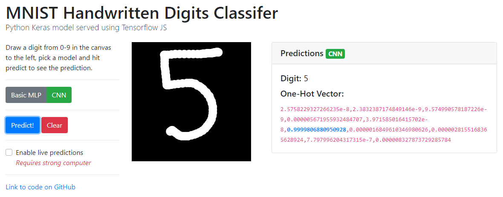

# MNIST Handwritten Digits Classifer Online

Multiple Python Keras models, trained on the MNIST dataset, served on a interactive webpage through the use of Tensorflow JS for loading and getting predictions from the model and p5.js for canvas operations.



[Link](https://mnist.surajram.xyz)

## Models Used
*Model training files are located in `/model-generation`*
### Basic MLP
```
Model: "sequential"
_________________________________________________________________
Layer (type)                 Output Shape              Param #   
=================================================================
flatten (Flatten)            (None, 784)               0         
_________________________________________________________________
dense (Dense)                (None, 512)               401920    
_________________________________________________________________
dense_1 (Dense)              (None, 256)               131328    
_________________________________________________________________
dense_2 (Dense)              (None, 128)               32896     
_________________________________________________________________
dropout (Dropout)            (None, 128)               0         
_________________________________________________________________
dense_3 (Dense)              (None, 10)                1290      
=================================================================
Total params: 567,434
Trainable params: 567,434
Non-trainable params: 0
_________________________________________________________________
```
Eval. Accuracy: `313/313 [==============================] - 0s 888us/step - loss: 0.0811 - accuracy: 0.9791`
### CNN
```
Model: "sequential"
_________________________________________________________________
Layer (type)                 Output Shape              Param #   
=================================================================
conv2d (Conv2D)              (None, 26, 26, 64)        640       
_________________________________________________________________
max_pooling2d (MaxPooling2D) (None, 13, 13, 64)        0
_________________________________________________________________
conv2d_1 (Conv2D)            (None, 11, 11, 64)        36928     
_________________________________________________________________
max_pooling2d_1 (MaxPooling2 (None, 5, 5, 64)          0
_________________________________________________________________
flatten (Flatten)            (None, 1600)              0
_________________________________________________________________
dense (Dense)                (None, 512)               819712    
_________________________________________________________________
dense_1 (Dense)              (None, 256)               131328
_________________________________________________________________
dense_2 (Dense)              (None, 128)               32896
_________________________________________________________________
dropout (Dropout)            (None, 128)               0
_________________________________________________________________
dense_3 (Dense)              (None, 10)                1290
=================================================================
Total params: 1,022,794
Trainable params: 1,022,794
Non-trainable params: 0
_________________________________________________________________
```
Eval. Accuracy: `313/313 [==============================] - 1s 4ms/step - loss: 0.0439 - accuracy: 0.9891`


